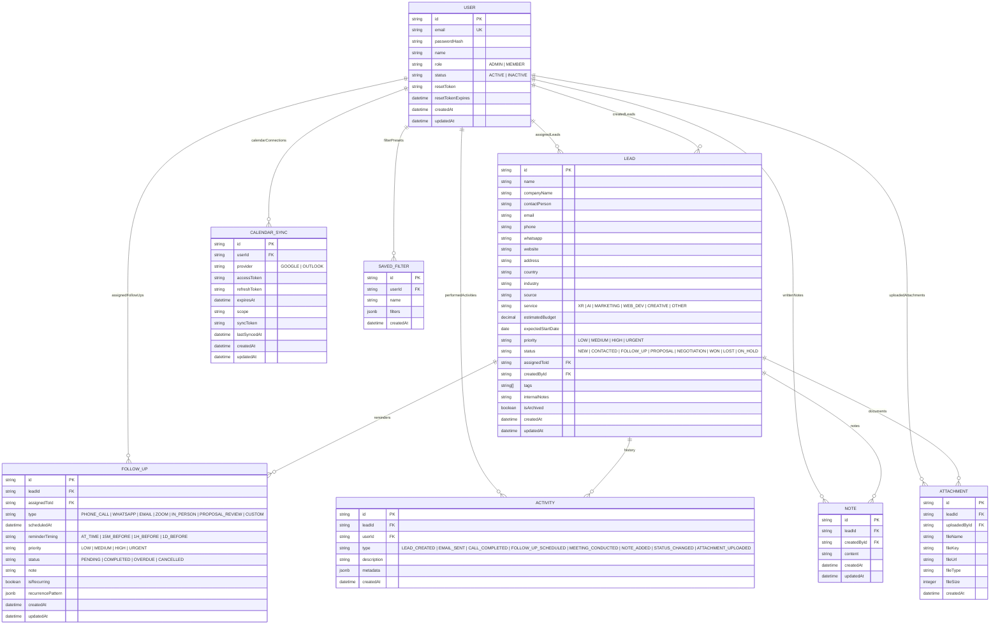
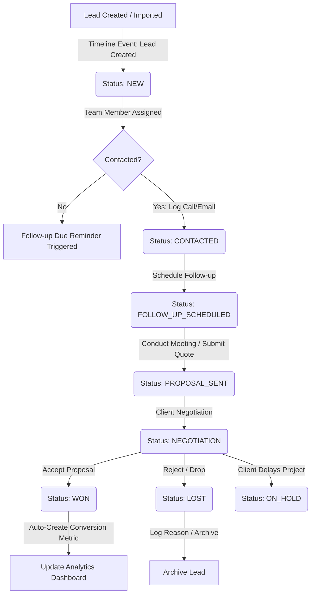
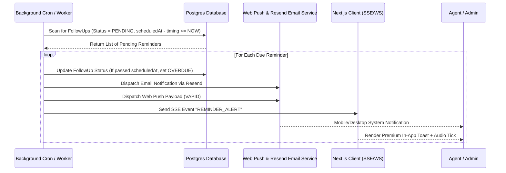

# Visual Drift Connect: Technical Architecture & System Design Spec

This document details the production-ready system architecture, database design, user flows, UI/UX specs, and API specifications for **Visual Drift Connect**—a premium, lightweight CRM tailored for Visual Drift (a digital agency specializing in XR, AI, Web, and Creative Services).

---

## 1. Information Architecture (IA)

Visual Drift Connect is structured to minimize friction and prioritize immediate follow-up visibility. The IA consists of a single-page feel with side-drawers (slide-overs) for detail views, keeping the user in context.

```
[Visual Drift Connect Root]
├── (Public Routes)
│   ├── Login (/auth/login)
│   ├── Forgot Password (/auth/forgot-password)
│   └── Reset Password (/auth/reset-password)
│
└── (Authenticated Routes - Layout with Sidebar / Nav)
    ├── Dashboard (/dashboard)
    │   ├── KPI Widgets (Leads, Hot Leads, Follow-ups, Conversion Rate)
    │   ├── Lead Acquisition & Conversion Charts
    │   ├── Recent Activities Timeline
    │   └── Due/Overdue Follow-ups List
    │
    ├── Leads (/leads)
    │   ├── Board View (Kanban board for Pipeline)
    │   ├── List View (Data table with advanced multi-select filters)
    │   └── Lead Details Drawer (Slide-over drawer)
    │       ├── Basic & Lead Info Form (Edit mode)
    │       ├── Follow-up Planner (Add/Edit reminders)
    │       ├── Chronological Activity Timeline
    │       ├── Notes Pane (Rich text notes)
    │       └── Attachments Panel (Drag-and-drop uploads)
    │
    ├── Calendar (/calendar)
    │   ├── Day, Week, Month Views
    │   ├── Drag-and-Drop Event Rescheduling
    │   └── Google/Outlook Sync Status Toggle
    │
    ├── Reports & Analytics (/reports)
    │   ├── Lead Metrics (by Source, Service, Status)
    │   ├── Performance Metrics (Completed tasks, conversion speed)
    │   ├── Revenue Pipeline (Won vs Estimated Value)
    │   └── Export Actions (PDF / Excel download)
    │
    └── Settings (/settings)
        ├── Account & Profile
        ├── Integrations (Google Calendar, Microsoft Outlook, Resend SMTP)
        ├── User Management (Admin Only - Add/Edit/Disable users & assign roles)
        ├── Lead Configurations (Custom Tags, Source definitions, Service budgets)
        └── Notification Settings (In-app, Email, Browser Push)
```

---

## 2. Database Schema & ER Diagram

The database utilizes PostgreSQL for robust relational integrity, JSONB support for integration metadata, and native indexing for rapid global search.

### Entity Relationship Diagram (ERD)



---

## 3. User Flow Diagrams

### Lead Lifecycle Flow

The transition of a lead from inbound/outbound creation to closed-won/lost, highlighting auto-generated timelines and follow-up requirements.



### Follow-Up Reminder & Web Push Notification Flow

How the system checks, fires, and visualizes reminder alerts in real-time.



---

## 4. Screen Wireframe Descriptions

### 1. Unified Dashboard Layout
*   **Sidebar Navigation**: Logo (Visual Drift), collapsible links: Dashboard, Leads, Calendar, Reports, Settings. Bottom profile badge with Light/Dark toggle.
*   **Top Header**: Global search bar (Hotkeys `Cmd+K`), notification bell with counter, Quick-Add button (`+ Lead`).
*   **Main Workspace**:
    *   *Top Grid*: 4 small cards showing: Total Leads, New Leads (Month), Active Follow-Ups (Due Today / Overdue in red badge), Converted Projects with Conversion Rate.
    *   *Middle Grid*:
        *   Left: **Monthly Acquisition & Conversion Trends** (combining interactive Area & Line chart).
        *   Right: **Lead Status Distribution** (Donut chart with custom legend matching Visual Drift color codes).
    *   *Bottom Grid*:
        *   Left: **Due Today & Overdue Reminders** list with quick-complete checkbox and action buttons (e.g., "Call Now", "WhatsApp").
        *   Right: **Global Activity Timeline** displaying chronological mini-cards (e.g., "Sarah updated lead Acme Corp to Proposal Sent 5m ago").

### 2. Lead Management Workspace (Board & List)
*   **View Toggle**: Tabs to switch between **Kanban Board** and **Data Table (List)**.
*   **Filters Bar**: Search inputs, Dropdowns (Source, Service, Assignee, Priority, Tags), "Save Preset" filter action.
*   **Kanban Board**: Drag-and-drop columns corresponding to Status (New, Contacted, Follow-Up Scheduled, Proposal Sent, Negotiation, Won, Lost). Cards show Company Name, Contact Person, Priority Badge, Budget, and Next Action Date.
*   **Data Table**: Columns: Name, Company, Email, Phone, Services (badges), Estimated Budget, Status (pill), Next Follow-Up Date, Assignee Avatar. Includes batch actions: "Export Select", "Change Assignee", "Delete".
*   **Lead Details Slide-over Drawer (35% width)**:
    *   Slides in from the right when clicking a lead. Tabbed navigation inside drawer: **Overview**, **Follow-ups**, **Notes (Rich Text)**, **Files/Contracts**, **Activity Log**.
    *   Includes a header with status selector dropdown and quick actions (Archive, Duplicate, Delete).

### 3. Interactive Calendar Screen
*   **Header**: Views tabs (Day, Week, Month), navigation keys (Prev, Today, Next), "Sync Settings" link.
*   **Calendar Grid**: Full-screen grid. Displays meetings and follow-ups. Color-coded by priority (Urgent is Electric Violet, High is Electric Blue, Medium is Cyan, Low is Slate).
*   **Behavior**: Events can be dragged to new slots (auto-updates scheduled date/time and syncs back to Google/Outlook Calendar). Clicking an event opens the Lead Details slide-over.

---

## 5. UI/UX Specifications & Styling Tokens

Visual Drift Connect features a **premium, dark-first modern design** with rich gradients, clean borders, glassmorphic accents, and smooth micro-animations.

### Color System (Tailwind CSS Config)

```javascript
// tailwind.config.js - Extends for Visual Drift Brand Theme
module.exports = {
  theme: {
    extend: {
      colors: {
        border: 'hsl(var(--border))',
        background: 'hsl(var(--background))',
        foreground: 'hsl(var(--foreground))',
        primary: {
          DEFAULT: 'hsl(267, 100%, 61%)',    // Electric Violet (XR & Immersive theme)
          foreground: 'hsl(210, 40%, 98%)',
        },
        secondary: {
          DEFAULT: 'hsl(191, 91%, 49%)',  // Tech Cyan (AI & Web development theme)
          foreground: 'hsl(222, 47%, 11%)',
        },
        accent: {
          DEFAULT: 'hsl(280, 85%, 55%)',   // Neon Purple (Creative/Design)
          foreground: 'hsl(210, 40%, 98%)',
        },
        destructive: {
          DEFAULT: 'hsl(346, 84%, 61%)',  // Deep Coral / Red for Overdue
          foreground: 'hsl(210, 40%, 98%)',
        },
        muted: {
          DEFAULT: 'hsl(215, 27.9%, 16.9%)', // For dark-mode backgrounds
          foreground: 'hsl(215, 20.2%, 65.1%)',
        },
        card: {
          DEFAULT: 'hsl(224, 71%, 4%)',       // Rich Deep Black/Blue Card base
          foreground: 'hsl(213, 31%, 91%)',
        }
      },
      borderRadius: {
        lg: '12px',
        md: '8px',
        sm: '4px',
      },
      fontFamily: {
        sans: ['Inter', 'sans-serif'],
        display: ['Outfit', 'sans-serif'], // Premium headings
      }
    }
  }
}
```

### Light vs Dark CSS Custom Properties (`global.css`)

```css
:root {
  --background: 210 20% 98%;
  --foreground: 224 71% 4%;
  --card: 0 0% 100%;
  --card-foreground: 224 71% 4%;
  --border: 220 13% 91%;
  --primary: 267 100% 61%;
  --secondary: 191 91% 49%;
  --destructive: 346 84% 61%;
  --muted: 220 14.3% 95.9%;
  --muted-foreground: 220 8.9% 46.1%;
}

.dark {
  --background: 224 71% 4%;
  --foreground: 213 31% 91%;
  --card: 222 47% 7%;
  --card-foreground: 213 31% 91%;
  --border: 217.2 32.6% 17.5%;
  --primary: 267 100% 61%;
  --secondary: 191 91% 49%;
  --destructive: 346 84% 61%;
  --muted: 217.2 32.6% 17.5%;
  --muted-foreground: 215 20.2% 65.1%;
}
```

### Micro-Animations
*   **Transitions**: Standard state shifts are `transition-all duration-200 ease-in-out`.
*   **Hover effects**: Action cards lift slightly on hover (`hover:-translate-y-1 hover:shadow-[0_8px_30px_rgb(108,92,231,0.2)]`).
*   **Drawers & Modals**: Smooth slide-in-from-right using CSS Keyframes (`animate-slide-in`).
*   **Kanban drag**: Light scaling and drop preview indicator with outline-dashed green/cyan borders.

---

## 6. Monorepo Project Folder Structure

A standardized TypeScript monorepo ensures the clean separation of frontend components, shared DB schema, and scalable backend logic.

```
visual-drift-connect/
├── apps/
│   ├── web/                    # Next.js Frontend (App Router, Tailwind CSS, shadcn/ui)
│   │   ├── src/
│   │   │   ├── app/            # App Routes & Pages
│   │   │   ├── components/     # UI, Forms, Charts, Dashboard widgets
│   │   │   ├── hooks/          # Custom hooks (e.g., useCalendarSync, useReminderPush)
│   │   │   ├── lib/            # Axios API client, queryClient, NextAuth configs
│   │   │   └── context/        # Global context (Theme, Auth states)
│   │   ├── public/             # Static assets, branding logos
│   │   ├── tailwind.config.js
│   │   └── package.json
│   │
│   └── api/                    # NestJS Backend API
│       ├── src/
│       │   ├── auth/           # RBAC, Local strategy, token handlers
│       │   ├── leads/          # CRUD controllers & services
│       │   ├── followups/      # Reminder logic, schedule manager
│       │   ├── integrations/   # Google Calendar & MS Graph OAuth clients
│       │   ├── communications/ # Resend integrations, web push dispatcher
│       │   ├── reports/        # Query-heavy aggregations (analytics)
│       │   ├── app.module.ts
│       │   └── main.ts
│       └── package.json
│
├── packages/
│   ├── database/               # Shared DB package containing Prisma models
│   │   ├── prisma/
│   │   │   └── schema.prisma
│   │   ├── src/
│   │   │   └── index.ts        # Exports instantiated PrismaClient
│   │   └── package.json
│   │
│   └── types/                  # Shared TypeScript models and payload interfaces
│       ├── src/
│       │   └── index.ts        # Common HTTP payload interfaces (Leads, Auth, Stats)
│       └── package.json
│
├── package.json                # Workspace script root (Turborepo orchestration)
├── turbo.json                  # Turborepo build caching configuration
└── README.md
```

---

## 7. API Specifications (REST)

All API requests expect `Content-Type: application/json` and require a Bearer JWT Token in the authorization header (except public auth endpoints).

### Authentication
*   `POST /api/auth/login` -> Authenticates credentials, returns JWT token & User details.
*   `POST /api/auth/forgot-password` -> Takes `{ email }`, sends recovery email, returns 200.
*   `POST /api/auth/reset-password` -> Takes `{ token, newPassword }`, resets password, returns 200.

### Leads Module
*   `GET /api/leads` -> Queries all leads. Supports query params: `page`, `limit`, `search`, `status`, `assignedToId`, `priority`, `service`, `sortBy`.
*   `POST /api/leads` -> Create new lead. Body parameters correspond to the lead schema.
*   `GET /api/leads/:id` -> Returns single lead with nested notes, attachments, and timeline activities.
*   `PUT /api/leads/:id` -> Updates fields. Fires system action logs automatically.
*   `DELETE /api/leads/:id` -> Soft-deletes or archives lead based on role. Only Admin can hard delete.
*   `POST /api/leads/:id/duplicate` -> Clones lead data, resetting status to `NEW` and assigning to current user.

### Follow-Ups Module
*   `POST /api/followups` -> Creates follow-up and queues in memory scheduler.
*   `PUT /api/followups/:id` -> Edit scheduling details (triggers recalculation of background cron jobs).
*   `PATCH /api/followups/:id/status` -> Updates status (e.g., to `COMPLETED` or `CANCELLED`).
*   `GET /api/followups/due` -> Fetches all items scheduled for current user due within the current time slice.

### Import/Export & Integrations
*   `POST /api/contacts/import/csv` -> Receives CSV payload, performs duplicate detection on `email` and `phone`, yields report of `insertedCount` and `duplicateMatches`.
*   `POST /api/contacts/import/resolve-duplicates` -> Body: `{ resolveAction: 'merge' | 'skip', matches: [...] }`.
*   `GET /api/contacts/export` -> Query param: `format=csv|excel|pdf`. Returns file download binary.
*   `GET /api/integrations/google/auth-url` -> Returns Google OAuth consent URL.
*   `GET /api/integrations/google/callback` -> Saves refreshToken to `CalendarSync` and redirect user.

---

## 8. Prisma Schema (`schema.prisma`)

```prisma
datasource db {
  provider = "postgresql"
  url      = env("DATABASE_URL")
}

generator client {
  provider = "prisma-client-js"
}

enum Role {
  ADMIN
  MEMBER
}

enum Priority {
  LOW
  MEDIUM
  HIGH
  URGENT
}

enum LeadStatus {
  NEW
  CONTACTED
  FOLLOW_UP_SCHEDULED
  PROPOSAL_SENT
  NEGOTIATION
  WON
  LOST
  ON_HOLD
}

enum ServiceType {
  XR
  AI
  MARKETING
  WEB_DEV
  CREATIVE
  OTHER
}

enum FollowUpType {
  PHONE_CALL
  WHATSAPP
  EMAIL
  ZOOM
  IN_PERSON
  PROPOSAL_REVIEW
  CUSTOM
}

enum FollowUpStatus {
  PENDING
  COMPLETED
  OVERDUE
  CANCELLED
}

enum ActivityType {
  LEAD_CREATED
  EMAIL_SENT
  CALL_COMPLETED
  FOLLOW_UP_SCHEDULED
  MEETING_CONDUCTED
  NOTE_ADDED
  STATUS_CHANGED
  ATTACHMENT_UPLOADED
}

model User {
  id                 String         @id @default(uuid())
  email              String         @unique
  passwordHash       String
  name               String
  role               Role           @default(MEMBER)
  status             String         @default("ACTIVE")
  resetToken         String?
  resetTokenExpires  DateTime?
  assignedLeads      Lead[]         @relation("AssignedLeads")
  createdLeads       Lead[]         @relation("CreatedLeads")
  followUps          FollowUp[]
  activities         Activity[]
  notes              Note[]
  attachments        Attachment[]
  calendarSyncs      CalendarSync[]
  savedFilters       SavedFilter[]
  createdAt          DateTime       @default(now())
  updatedAt          DateTime       @updatedAt

  @@index([email])
}

model Lead {
  id                 String       @id @default(uuid())
  name               String
  companyName        String?
  contactPerson      String
  email              String
  phone              String?
  whatsapp           String?
  website            String?
  address            String?
  country            String?
  industry           String?
  source             String
  service            ServiceType
  estimatedBudget    Decimal?     @db.Decimal(12, 2)
  expectedStartDate  DateTime?
  priority           Priority     @default(MEDIUM)
  status             LeadStatus   @default(NEW)
  assignedToId       String?
  assignedTo         User?        @relation("AssignedLeads", fields: [assignedToId], references: [id], onDelete: SetNull)
  createdById        String
  createdBy          User         @relation("CreatedLeads", fields: [createdById], references: [id])
  tags               String[]
  internalNotes      String?
  isArchived         Boolean      @default(false)
  followUps          FollowUp[]
  activities         Activity[]
  notes              Note[]
  attachments        Attachment[]
  createdAt          DateTime     @default(now())
  updatedAt          DateTime     @updatedAt

  @@index([status])
  @@index([assignedToId])
  @@index([email])
  @@index([companyName])
}

model FollowUp {
  id             String         @id @default(uuid())
  leadId         String
  lead           Lead           @relation(fields: [leadId], references: [id], onDelete: Cascade)
  assignedToId   String
  assignedTo     User           @relation(fields: [assignedToId], references: [id], onDelete: Cascade)
  type           FollowUpType
  scheduledAt    DateTime
  reminderTiming String         @default("AT_TIME") // "AT_TIME", "15M_BEFORE", "1H_BEFORE", "1D_BEFORE"
  priority       Priority       @default(MEDIUM)
  status         FollowUpStatus @default(PENDING)
  note           String?
  isRecurring    Boolean        @default(false)
  recurrence     Json?          // Stores pattern rules if recurring
  createdAt      DateTime       @default(now())
  updatedAt      DateTime       @updatedAt

  @@index([scheduledAt])
  @@index([status])
  @@index([assignedToId])
}

model Activity {
  id          String       @id @default(uuid())
  leadId      String
  lead        Lead         @relation(fields: [leadId], references: [id], onDelete: Cascade)
  userId      String
  user        User         @relation(fields: [userId], references: [id])
  type        ActivityType
  description String
  metadata    Json?        // Optional payload detailing changes (ex: old/new status values)
  createdAt   DateTime     @default(now())

  @@index([leadId])
  @@index([createdAt])
}

model Note {
  id          String   @id @default(uuid())
  leadId      String
  lead        Lead     @relation(fields: [leadId], references: [id], onDelete: Cascade)
  createdById String
  createdBy   User     @relation(fields: [createdById], references: [id])
  content     String   @db.Text
  createdAt   DateTime @default(now())
  updatedAt   DateTime @updatedAt

  @@index([leadId])
}

model Attachment {
  id           String   @id @default(uuid())
  leadId       String
  lead         Lead     @relation(fields: [leadId], references: [id], onDelete: Cascade)
  uploadedById String
  uploadedBy   User     @relation(fields: [uploadedById], references: [id])
  fileName     String
  fileKey      String   // S3/Cloudinary object identifier
  fileUrl      String
  fileType     String
  fileSize     Int
  createdAt    DateTime @default(now())

  @@index([leadId])
}

model CalendarSync {
  id           String   @id @default(uuid())
  userId       String
  user         User     @relation(fields: [userId], references: [id], onDelete: Cascade)
  provider     String   // "GOOGLE" or "OUTLOOK"
  accessToken  String
  refreshToken String
  expiresAt    DateTime
  scope        String?
  syncToken    String?  // Sync token returned from calendar providers for delta pulls
  lastSyncedAt DateTime?
  createdAt    DateTime @default(now())
  updatedAt    DateTime @updatedAt

  @@unique([userId, provider])
}

model SavedFilter {
  id        String   @id @default(uuid())
  userId    String
  user      User     @relation(fields: [userId], references: [id], onDelete: Cascade)
  name      String
  filters   Json     // Saved search criteria parameters
  createdAt DateTime @default(now())
}
```

---

## 9. Backend Architecture (NestJS)

NestJS will act as the scalable server framework. It structure utilizes a modular design layout, ensuring fast, loosely coupled modules.

*   **Modular Organization**: Modules split into `AuthModule`, `LeadsModule`, `FollowUpModule`, `SyncModule`, `ReportModule`, and `SharedModule`.
*   **Database Access**: A central `PrismaService` inside `SharedModule` manages lifecycle connections to Postgres.
*   **Request Pipeline Utilities**:
    *   *Guards*: `JwtAuthGuard` checks requests for authentication. `RolesGuard` ensures that only `@Roles(Role.ADMIN)` can trigger administrative actions like user deletion and global reports download.
    *   *Validation Pipe*: Uses native `class-validator` and `class-transformer` decorators to enforce type validation on all incoming request body shapes (DTOs).
*   **Job Queue (BullMQ + Redis)**: Employs a queuing engine to offload email dispatch operations, third-party calendar sync transactions, and recurring follow-up updates.

---

## 10. Frontend Architecture (Next.js)

Built using Next.js App Router, Visual Drift Connect acts as a single-page progressive dashboard.

*   **Hybrid Rendering Strategy**:
    *   *Server Components*: Render layouts, dashboard frameworks, and initial static components.
    *   *Client Components*: Drag-and-drop calendar boards, interactive graphs, forms, and custom settings widgets.
*   **State Management & Data Fetching**:
    *   Uses `@tanstack/react-query` for API caching, mutation states, optimistic UI updates (critical during Kanban drag-and-drop operations), and polling intervals for notification updates.
    *   Uses `zustand` for lightweight client states (theme configs, sidebar collapsed states, and filtering parameters presets).
*   **Interactive Controls & Styling**:
    *   Built using headless building blocks from `@radix-ui` (via shadcn/ui custom imports).
    *   Form layouts governed by `react-hook-form` paired with `zod` schema constraints validation.

---

## 11. Authentication Flow

Visual Drift Connect implements a NextAuth (Auth.js) structure leveraging JWT Tokens and Role-Based Access Control.

```
[User Form Login] 
       │ 
       ▼
[NextAuth Credentials Provider] ────► [Compare Passwords (bcrypt)]
       │                                       │
       ▼ (Valid)                               ▼ (Invalid)
[Issue Signed JWT Cookie]               [Return 401 Unauthorized]
       │
       ├─► JWT Payload contains: `userId`, `role` (ADMIN/MEMBER)
       │
       ▼
[Next.js Middleware Check]
       ├─► Route: /settings/users -> Access allowed only if role = ADMIN
       └─► Route: /dashboard -> Access allowed for all validated users
```

For Password recovery:
1. User requests reset -> API creates temporary secure `resetToken` in Postgres valid for 1 hour and sends rich link via Resend.
2. User submits new password on `/auth/reset-password?token=XYZ` -> API validates token signature, hashes password via bcrypt, clears token, and updates DB record.

---

## 12. Calendar Synchronization Flow

Visual Drift Connect supports two-way synchronization between our CRM calendar activities and Google/Outlook accounts.

### Two-Way Google Calendar Sync Details

1.  **OAuth Connection**: User goes to Settings -> Integrations -> Connect Google Calendar. Consent grants `https://www.googleapis.com/auth/calendar.events` scope. API stores the securely encrypted Refresh Token in `CalendarSync`.
2.  **Local to External Sync (Push)**: When a follow-up Zoom meeting, Call, or In-person meeting is created/scheduled in the CRM:
    *   Create Calendar Sync Job in BullMQ queue.
    *   BullMQ worker pulls refreshToken, exchanges it for an accessToken, and issues a `POST` request to `/calendar/v3/calendars/primary/events` containing details.
    *   Saves the returned Google Event ID to the CRM's `FollowUp.metadata.googleEventId`.
3.  **External to Local Sync (Pull Webhook)**:
    *   We establish a channel connection with Google Calendar's notification service (`push` channel) pointed to `/api/integrations/google/webhook`.
    *   When an event is edited or deleted directly in Google Calendar, Google triggers our webhook.
    *   The Webhook worker uses the stored `syncToken` to fetch changes, locates the corresponding `FollowUp` record using the Event ID mapping, and updates dates/notes accordingly. Avoids duplication by comparing Google Event ID to local metadata records.

---

## 13. Reminder Engine Design

The reminder engine is the core feature of the system, ensuring that agents never miss follow-ups.

### System Components

```
   ┌────────────────────────────────────────────────────────┐
   │                  Follow-up Scheduler                   │
   │   - Runs as a persistent cron process every 1 minute   │
   └───────────────────────────┬────────────────────────────┘
                               │
                               ▼
            [Query DB for Due/Overdue Reminders]
                               │
            ┌──────────────────┴──────────────────┐
            ▼                                     ▼
   [In-App SSE Broadcast]                 [Background Email Job]
    Fires direct Event                     Dispatches templated
    to active user's socket                alert to assignee's email
            │                                     │
            ▼                                     ▼
 ┌──────────────────────┐              ┌──────────────────────┐
 │ Glassmorphic Toast   │              │ Resend API Delivery  │
 │ Notification UI      │              │ "Follow-up Due Now!" │
 └──────────────────────┘              └──────────────────────┘
```

*   **Scheduler Worker (Ticker)**:
    *   Runs every 60 seconds.
    *   Scans database for `FollowUp` items where `status = PENDING` and target trigger time (scheduledAt minus offset) is less than or equal to current timestamp.
*   **SSE Notification Controller**:
    *   Maintains long-lived HTTP connection (`/api/notifications/subscribe`) with signed-in clients.
    *   Broadcasts alerts to users.
*   **Web Push Engine (Browser Notifications)**:
    *   Uses VAPID key pairs. Service worker inside Next.js intercepts incoming push triggers and displays OS-level notification alerts even when the browser is minimised or closed.

---

## 14. Step-by-Step Implementation Roadmap

### Phase 1: Foundation & Auth Setup (Weeks 1 - 2)
*   [ ] Initialize Turborepo with database package and Next.js / NestJS applications.
*   [ ] Set up Prisma client with PostgreSQL schema, seed script containing mock leads and users.
*   [ ] Configure local and JWT auth strategy in NestJS and NextAuth integration in Next.js.
*   [ ] Construct layout component shell: responsive sidebar, theme engine context (Dark/Light).

### Phase 2: Core Lead Engine & Timeline (Weeks 3 - 4)
*   [ ] Implement Leads Controller (CRUD, pagination, text search).
*   [ ] Create Kanban board layout and list view datatable in Next.js app.
*   [ ] Develop detail slide-over drawer (showing main forms, activity logging engine, notes area).
*   [ ] Setup S3/Cloudinary storage bucket configurations for drag-and-drop document uploads.

### Phase 3: Follow-Up Scheduler & Reminder Engine (Weeks 5 - 6)
*   [ ] Implement follow-up planner forms.
*   [ ] Write NestJS cron tickers checking pending triggers and BullMQ integration.
*   [ ] Develop Server-Sent Events controller to dispatch alerts instantly.
*   [ ] Implement Web Push registration logic and Service Worker in client-side app.
*   [ ] Connect Resend email SMTP client module.

### Phase 4: Integrations (Calendar & CSV) (Weeks 7 - 8)
*   [ ] Implement CSV import parser, mapping headers, and duplicate validation step.
*   [ ] Build OAuth flows for Google Calendar and Microsoft Graph.
*   [ ] Implement two-way synchronization queue workers and event webhook listeners.
*   [ ] Develop drag-and-drop interface support in the Next.js Calendar dashboard page.

### Phase 5: Reports, Polish & Testing (Weeks 9 - 10)
*   [ ] Create analytical views (conversion rates charts, active client pipelines).
*   [ ] Integrate export-to-PDF / CSV reports download scripts.
*   [ ] Conduct system QA: loading skeletons check, validation check, dark mode responsiveness.
*   [ ] Complete production server configurations and environment setup scripts.

---

## 15. Production Deployment Strategy

*   **Client App (Next.js)**: Deployed to **Vercel** for optimal Edge distribution, page load speeds, and assets compression.
*   **Backend Server (NestJS)**: Deployed on **Railway** (or AWS App Runner) inside Docker containers. Configured with automated health checks on `/api/health`.
*   **Database (PostgreSQL)**: Fully managed instance on AWS RDS or Supabase. Enabled with 7-day automated backups retention and connection pooling enabled.
*   **Cache & Queue Engine (Redis)**: Deployed on Railway Redis or Upstash. Handles worker job state memory.
*   **CI/CD Pipeline**: Github actions workflow:
    1.  Lint code, execute Jest unit tests, verify build outputs.
    2.  Build Docker image for NestJS API, push to container registry (AWS ECR / Railway registry).
    3.  Deploy to target host environment, applying database migrations using `prisma migrate deploy` prior to startup.

---

## 16. Future Enhancement Recommendations

1.  **AI Lead Matching & Prediction**: Parse historical lead interactions using LLM prompts to calculate an automated "Priority Score" and recommend follow-up timings based on conversion trends.
2.  **Automatic Email Drafting**: Provide a "Draft Email" click feature using context from previous timeline logs and client services requirements.
3.  **Visual Asset Previewer (XR integration)**: Add interactive 3D WebGL / Spline previews directly inside lead attachment drawers for clients reviewing immersive XR design layouts.
4.  **Omnichannel WhatsApp Webhook API Integration**: Transition from simple click-to-WhatsApp link redirects to direct business API integration, enabling lead threads logging inside the CRM timeline.
